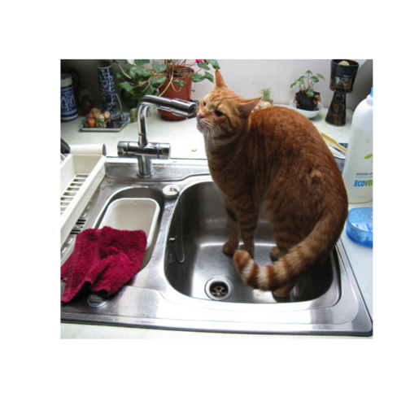

Best Practices Working With Spatial Data in R
========================================================
author: Alex M Chubaty
date: 02 May 2019
autosize: true
transition: rotate

Getting started
========================================================

Lots of great resources:

- <https://www.rspatial.org/>
- <https://www.r-spatial.org/> (note the dash)
- <https://datacarpentry.org/geospatial-workshop/>

A note about DataCamp:

- Recent mis-handling of sexual assault by DataCamp
- Many instructors advising people *not* use their courses, and are making them available elsewhere
- See <https://noamross.github.io/datacamp-sexual-assault/> for more info

Today's Workshop
========================================================

Notes available from <https://github.com/achubaty/r-talks/tree/master/spatial-data-best-practices>

0. CRAN taskviews:
  - <https://cran.r-project.org/web/views/Spatial.html>
  - <https://cran.r-project.org/web/views/SpatioTemporal.html>
1. Reading/loading spatial data
2. Basic plotting
3. **Gotchas and best practices**

What you'll need for today
========================================================

```r
install.packages(c("assertthat", "crayon", "raster", "rgdal", "sp"))

library(sp)
library(raster)
library(crayon)
```

Best Practices
========================================================

## References

- Bryan, J. 2017. Excuse me, do you have a moment to talk about version control? PeerJ Prepr. 5:1–23. https://peerj.com/preprints/3159v2/
- Visser M. D. _et al._. 2015. Speeding up ecological and evolutionary computations in R; essentials of high performance computing for biologists. PLOS Comput. Biol. 11:e1004140.
- Wilson, G. _et al._ 2014. Best practices for scientific computing. PLoS Biol. 12:e1001745.

R projects
=========================================================

Every project should be self-contained and use relative file paths.

```
myProject/
  |_ data/           ## shared data could be symlinked
  |_ outputs/
  |_ presentations/
  |_ publications/
  |_ scripts/
  |_ src/
```

Use RStudio projects!
- <https://support.rstudio.com/hc/en-us/articles/200526207-Using-Projects>

Don't save/load your workspace
=========================================================


Write scripts for people, not computers
========================================================

> it's great if others can use your code, but it's more important that you can reuse it

- comment your code with _why_ (design & purpose), not the _what_ (mechanics)
- use descriptive names (_nouns_ for objects; _verbs_ for functions)
- use consistent style/formatting
  - check formatting with `lintr` package

Make incremental changes
=========================================================

- use version control (e.g., git & GitHub)

Don't repeat yourself
=========================================================

- don't copy/paste
- don't copy paste
- don't copy/paste
- modularize code for reuse (use functions)

Expect mistakes
=========================================================

- use assertions & tests

```r
df1 <- data.frame(A = 1:26, B = sample(letters))
head(df1)

assertthat::assert_that(is(df1$A, "character")) ## why?
```

Collaborate
=========================================================

- pair programming
- code review

Optimize your code
=========================================================

- speed and memory improvements
- **only do this after code is working correctly**

Don't be greedy
========================================================

Especially on a shared system 😄

1. only use what you need;
2. improve your code so it's less greedy;
3. communicate your needs with other users.

What Does It Mean For Code To Be Greedy?
========================================================

1. RAM usage;
2. Disk I/O;
3. Disk storage (user and temp folders);
4. CPU time;
5. Network use.

The Basics (1)
========================================================

Remove intermediate objects to free RAM.

Save them to disk for retrieval later if you need them.

The Basics (2)
========================================================

Have the script quit the rsession when done to free RAM.

```r
exit <- Q <- function(save = "no", status = 0, runLast = TRUE) {
  q(save = save, status = 0, runLast = TRUE)
}
```

The Basics (3)
========================================================

To best use RAM, CPU, disk, and network when others aren't likely using them:

- Schedule your scripts to run at later time (RStudio v1.2)
- Stagger jobs using `Sys.sleep()`

Code profiling (1)
========================================================

Identify bottlenecks + high resource use

1. Run time

  ```r
  startTime <- Sys.time()
  reallyLongFunction()
  endTime <- Sys.time() - startTime
  message(cyan("reallyLongFunction() took ", endTime, "s to run."))
  ```

Code profiling (2)
========================================================

Identify bottlenecks + high resource use

2. Memory usage

  ```r
  r <- raster("~/data/LandCoverOfCanada2005_V1_4/LCC2005_V1_4a.tif")
  object.size(r)
  inMemory(r)
  ```

Code profiling (3)
========================================================

Identify bottlenecks + high resource use

3. Rstudio profiler

  - **profiling time**
    - <https://support.rstudio.com/hc/en-us/articles/218221837-Profiling-with-RStudio#profiling-time-example>

  - **profiling memory**
    - <https://support.rstudio.com/hc/en-us/articles/218221837-Profiling-with-RStudio#profiling-memory-example>

Memory Management in R
========================================================

Garbage collection is handled by R and your OS will try to free RAM that is no longer being used.

However, you can make scripts more efficient by frequently removing transient/intermediate objects from memory:

1. save to disk often (but not too often!);
2. load from disk when recovering your session (so you don't need to rerun everything each time);
3. cache your intermediate results (`reproducible::Cache()`)

Temp Storage (1)
========================================================

Many `raster` operations use tempfiles behind the scenes, which will clutter your temp drive (a big problem when the machine isn't rebooted frequently).

```r
## make a note of this location, restart R session, and rerun
raster::tmpDir()
```

Temp Storage (2)
========================================================

Use `rasterOptions()` to set `tmpdir` manually and be sure to cleanup at the end of your script/session.

```r
maxMemory <- 5e+7
scratchDir <- file.path("/tmp/scratch/MPB")

rasterOptions(default = TRUE)
options(rasterMaxMemory = maxMemory, rasterTmpDir = scratchDir)

raster::tmpDir()

...

unlink(raster::tmpDir(), recursive = TRUE)
```

Minimizing object/file size
========================================================

```r
> ?dataType
```

**Data type** | **min value**  | **max value**
--------------|----------------|--------------
LOG1S         | FALSE (0)      | TRUE (1)
INT1S         | -127           | 127
INT1U         | 0              | 255
INT2S         | -32,767        | 32,767
INT2U         | 0              | 65,534
INT4S         | -2,147,483,647 | 2,147,483,647
INT4U         | 0              | 4,294,967,296
FLT4S         | -3.4e+38       | 3.4e+38
FLT8S         | -1.7e+308      | 1.7e+308

Turn Off Your Clusters
========================================================

Cluster operations on Windows use more RAM than they should because Windows can't fork.

Always close your clusters when done to ensure that RAM gets freed.

```r
cl <- raster::beginCluster()
...
raster::endCluster(cl) ## in a function, put this in `on.exit()`
```

`raster` and `sp` gotchas
========================================================

- `RasterStack` converting to `RasterBrick`
- `writeRaster()` changes the projection
- Factor rasters are a *pain*
- Use buffer width 0 before intersection etc.
  - see `reproducible::fixErrors()` within `reproducible::prepInputs`

Other useful packages
=========================================================

```r
install.packages("sf")    ## will supercede `sp`
install.packages("stars") ## will supercede `raster`

## fast shapefile operations
devtools::install_github("s-u/fastshp")

## fast raster operations
install.packages("fasterize")
install.packages("velox")

## more wrappers for GDAL in R
install.packages("gdalUtils")
```

Questions?
=========================================================


```r
meow::meow()
```


